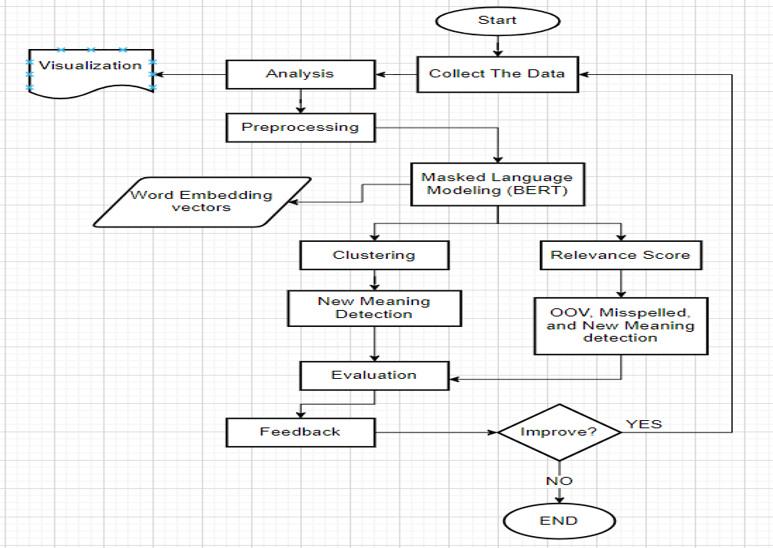

# Automating Novel Terms in Egyptian Arabic

# <a name ="1">Objective</a>

The project was part of our AI & Data Science Master's degree at the University of Ottawa. 

Check all the projects here: [Link](https://github.com/Mostafanofal453)

# <a name="2">Team Members</a>

[Khaled Elsaka](https://www.linkedin.com/in/khaled-el-saka-962700161/)

[Nada Montasser](https://www.linkedin.com/in/nada-montasser-014b1616b/)

[Shaimaa Mamdouh](https://www.linkedin.com/in/shaimaa-mamdouh-2616a9159/)

[Aya Reda](https://www.linkedin.com/in/aya-reda-5202b2191/)

[Mostafa Nofal](https://www.linkedin.com/in/mostafa-nofal-772625194/)

# <a name = "3">Overview</a>

Egyptian Arabic dialect is evolving rapidly and is affected by many local and global events. Those events encourage people to use novel words and even exploit the old ones in new senses. Such evolution in the Arabic dialect negatively affects many downstream fields that depend mainly on the Egyptian Arabic text, such as Arabic language translation, sentiment analysis, text summarization, chatbots, and others. The project solves a critical and challenging problem that is considered a preprocessing step for any natural language processing (NLP) task and so the benefits are countless. The objective of this project is to develop a machine-learning system that keeps track of the evolving Arabic language. This happens by detecting Arabic words used in new senses. Moreover, novel Arabic terms are detected and added to the Arabic dialect by solving the challenge of differentiating between the novel and misspelled words.

# <a name = "4">Project Methodology</a>

[ // ]: # "![image]&#40;https://drive.google.com/uc?export=view&id=1akpmZttK1SGFR5cTG4vdm0wkeM5bAGqg;"

# <a name = "5">Dataset</a>

**2.5+ Million Rows Egyptian Datasets Collection**

All the details in this [link](https://www.kaggle.com/datasets/mostafanofal/two-million-rows-egyptian-datasets)

| Dataset  Source                   | Kaggle  File Name                                            | Rows  Number                                             | Year |
| --------------------------------- | ------------------------------------------------------------ | -------------------------------------------------------- | ---- |
| 1. Arabic Online Commentary (AOC) | AOC_youm7_articles  AOC_youm7_comments  RestOf_AOC_youm7_comments  AOC_subtitles_authors | 688,550 rows  1,048,576 rows  333,225 rows  564,854 rows | 2010 |
| 2.Arabic Egyptian Tweets          | Egyptian Tweets                                              | 40,000 rows                                              | 2019 |
| 3. TaghreedT                      | TaghreedT                                                    | 13,740 rows                                              | 2021 |
| 4. Topic Extraction Data          | TE_News  TE_Sports  TE_Telecom  TE_Tweets                    | 2,256 rows  2,052 rows  2,358 rows  2,065 rows           | 2019 |
| 5. Habibi Lyrics Corpus           | Habibi                                                       | 139,162 rows                                             | 2019 |
| 6. Callhome Corpus                | Callhome                                                     | 9,637 rows                                               | 2014 |
| 7. ArabicReddit                   | Reddit                                                       | 10,129 rows                                              | 2021 |
| 8. ar_arz_wiki_corpus             | Arabic_Egyptian_Wikipedia                                    | 9,126 rows                                               | 2017 |
| 9. QCRI                           | QCRI                                                         | 350 rows                                                 | 2018 |
| 10. SADID                         | SADID                                                        | 8,989 rows                                               | 2020 |
| 11. DART                          | DART                                                         | 5,889 rows                                               | 2018 |

## <a name="7">Data Preprocessing</a>

Preprocessing Arabic text is an important step in our NLP project. Preprocessing Arabic text on social media, which is typically informal (not standard), is more difficult due to a variety of factors such as the presence of dialect text, common spelling errors, extra characters, diacritical marks, and elongations. As a result, we must perform additional processing to preprocess such Arabic text, such as stripping elongations, diacritical marks, and extra characters. As previously stated, the domain of our project is the Egyptian-Arabic dialect. We did some pre-processing on the Egyptian Dialect from social media and websites. Our method includes three preprocessing modules:

## <a name ="1">Removing Elongation</a>

*Popular Egyptian words on social media like Twitter and Facebook that are found in the data we have collected, are written in informal ways e.g., some words contain repeated characters such as "*مبرووووووك*" instead of "*مبروك*" which indicates congratulations, repeated characters such as "* جااااامد*" instead of "*جامد*" and "*ههههههههههههه*" which means laughing and include common spelling mistakes and/or dialects.* Our proposed normalization algorithm replaces a non-normal word with a normal one by removing the repeated characters.

## <a name ="1">Removing Tashkeel</a>

*In the Arabic language, there is a sort of art called Tashkeel to pronounce words in a proper way such as fathha, shadda, dama. We worked to remove any tashkeel that can be an obstacle in the Modeling phase and OOV detection**.*

## <a name ="1">Data Correction</a>

ِfter applying correction using ar_corrector,we found that this method did not fit into the complexity of the Egyptian dialect and the outcomes were not satisfying so we applied many methods to fit the best corrections to the text.*

Here is the data correction workflow:

## <a name ="1">Approaches</a>

## <a name = "9">BERT from Scratch</a>

Selecting the best BERT model is critical because the project's solutions depend on that model's outcome. Not only there are many pre-trained models, but also there are different paths that we can take. In figure 2, which path is better? Using a pre-trained model then fine-tuning (1a, 1b, 1d) or using the pre-trained then retraining on the domain-specific corpus (1a, 1b, 1c, 1d) or training the model from scratch of the domain-specific corpus (2a, 2b, 2d). The experiment results [30] state that it's better to train the model from scratch when working on domain-specific data, but if there is a pre-trained model which is trained on some data from that domain it's much better to retrain that model on more domain datasets. Although this project is not meant for any domain-specific corpus such as biomedical space, the same idea and characteristics exist. The Egyptian dialect has many different terms, phrases, and sentence structures than the modern standard Arabic (MSA).

**BERT From scratch:**

*The first approach is to train the BERT model from scratch on the collected dataset for some reasons first it will be easier to train on a dataset from period t1 and test from time t2 which will contain many novel terms and new usages for words and will be easier for testing. The second reason is that it will only be trained in the Egyptian dialect.*

Trained Roberta from scratch [31] on a sample of the dataset from period t1 for only 2 epochs to see quick results and improve later. The results weren't good in figure 2 for both fills in the blank and the word embedding test. The model was unable to predict the correct word for fill in the blank test and outputs only stop-words and outputs almost the same for other sentences. The cosine similarity test for the opposite words is higher than synonyms which is not correct.

## <a name ="1">Clustering </a>

After using the tokenizer of MARBERT and getting the word embeddings of each sentence and its words, We the unique words in the dataset to decrease duplication and save time. The word embedding for each word differs from one sentence to another depending on the context of the sentence.

  

We used DBSCAN, affinity propagation, and k-means with a range of k values for clustering. First experiment with K-means we build a function to return the cosine similarity to be used as a metric parameter for K-means instead of Euclidean metric. A cosine similarity metric is a way to improve the result by measuring the similarity between the words. The silhouette score is good by trying different K but not the best result. The problem of K-means needs the number of clusters, but this is hard as the number of words in the corpus is very large and can’t detect these different meanings manually. In a second experiment with DBSCAN, DBSCAN can categorize the word embeddings of the words and discriminate between noisy data. Epsilon (Eps1) and the minimal number of points/data (MinPoints), two parameters, are based on a user-defined neighbor radius and the number of points already present in the radius. But the issue of DBSCAN in this problem may be that some words are important and are categorized as noise data. In the past, affinity propagation has been utilized in a variety of linguistic tasks, including word sense induction. The incremental graph-based method that underlies affinity propagation is somewhat reminiscent of PageRank. Its primary advantage is that the number of clusters is not predetermined but rather inferred during training. Using common hyperparameters, we implemented Scikit-learn in this task. Finally, Affinity Propagation is the appropriate algorithm to apply with a silhouette score of 0.3 as shown in table (1) because doesn’t need several clusters on the contrary, it gives us the number of clusters for each word meaning, and if this meaning is changed or not would be in a different cluster as shown in figure (4).

| **Method**           | **silhouette score** |
| -------------------- | -------------------- |
| K Means              | **0.06**             |
| DBSCAN               | **0.02**             |
| Affinity Propagation | **0.3**              |

## <a name ="1">MARBERT</a>

*The first approach is to train the BERT model from scratch on the collected dataset for some reasons The plan was to improve that model at the beginning but after some search, a better model was found in MARBERT [32] which is focused on both Dialectal Arabic (DA) and MSA and trained on 1B Arabic tweets from different dialects including the Egyptian, The dataset makes up 128GB of text (15.6B tokens) and 100k word piece. The model outperformed 21 models (75%) and was outperformed by seven models (25%) [33], and achieves the SOTA on 30 out of 43 datasets on 5 tasks (sentiment analysis, social meaning, topic classification, dialect identification, and named entity recognition) [38] and performs best when dealing with dialectal data.*

*After trying MAERBERT the results make more sense in figure 3. The predicted answers for the fill in the blank sentence are correct and they are synonyms. The semantic similarity using the cosine similarity metric is high for synonyms and lower for opposite words and much lower for irrelevant words. The word and its opposite could be used in the same context and that’s why the opposite words have higher cosine similarity than the irrelevant ones.*

# <a name="10">Validation & Verification</a>

Regarding the model evaluation, we will select some words to represent the new words (OOV) from the dataset and search for their sentences. Those sentences that contain our selected OOV are our test data. We collected 11 datasets of the MARBert model train data from its GitHub repository. There were two reasons for that. One was to build the corpus for the correction part by splitting all of the sentences into separate words to compare with the misspelled data. The second reason is to search for context change sentences.

# <a name="14">Overall Results and Analysis</a>

## <a name ="1">Evaluation</a>

Regarding the evaluation dataset. The model trained on data until 2020. We chose to search in Goodreads website for Egyptian dialect books. We found 9 books and picked one published in 1994 which is older than the model. The second dataset from Facebook consists of Egyptian Dialect Corpus. It was released in 2021 which is newer than the training data from the model.

## <a name ="1">True Labeling</a>

We selected the list of words for the evaluation based on the four conditions mentioned before and changed the threshold to filter the most accurate words for us.

## <a name ="1">Analysis</a>

When it comes to the comparison between the models. The model made from scratch definitely needed a lot of time to train so we moved to try the other approaches. What was good about the solution based on the relevance score is its general purpose. It can detect all kinds of novel terms whether they are completely new, misspelled, or words that have changed their meaning. Also, we didn’t need to train the model on all the corpus compared to the clustering model. Finally, we can use a threshold to filter the number of words that came from it to take the most accurate ones. Regarding the outcomes, the project helped us to know how to deal with BERT which is one of the most well-known models in NLP as well as various ways to correct misspelled words and finally how to deploy our solution to a website by using flask.

# <a name ="1">Conclusions and Future Works</a>

Detecting the novel terms while differentiating between them and the misspelled ones and also detecting the words with a new usage. The available solutions focus on analyzing the meaning change of the words by selecting a sample of words and clustering their embeddings to find the words with new meanings. While we’ve tried this solution too, it’s not practical to cluster all the words in the corpus. This project handles a new problem and provides and new general practical solution which is the relevance score for not only the meaning change detection but also the novel and misspelled words. No need for clustering all the corpora, the inputs are the text, and the filtering threshold then the novel, misspelled new meaning, and normal words are filtered. Testing the solution is also a challenge as the MARBERT model was trained on some data which is from 2020 and the collected test data is from 2021 (Taghreed). The time gap between them is small and the new words in the test data are rare. moreover, the selected test words require human labeling and can sometimes be incorrect. In general, the solution is logically robust but depends on some factors which require improvements like retraining the MARBERT model on more Egyptian text, improving the correction, and Hyperparameter-tuning for the novel terms and new meaning threshold to use the optimal value.

# <a name ="1">References</a>

*[1] Omar F. Zaidan and Chris Callison-Burch. 2011. The Arabic Online Commentary Dataset: an Annotated Dataset of Informal Arabic with High Dialectal Content. In Proceedings of the 49th Annual Meeting of the Association for Computational Linguistics: Human Language Technologies, pages 37–41, Portland, Oregon, USA. Association for Computational Linguistics.* 

*[2] Kora, R., & Mohammed, A. (2019). Corpus on Arabic Egyptian tweets [Data set]. Harvard Dataverse. https://doi.org/10.7910/DVN/LBXV9O*

*[3] Tarmom, T., Teahan, W., Atwell, E. and Alsalka, M.A., 2020. Compression versus traditional machine learning classifiers to detect code-switching in varieties and dialects: Arabic as a case study. Natural Language Engineering, 26(6), pp.663-676.*

*‌[4] nadaaym, “Topic-extraction-data,” GitHub, Jan. 20, 2019. https://github.com/nadaaym/Topic-extraction-data (accessed Jan. 15, 2023).*

*[5]“Index of /habibi,” ucrel-web.lancaster.ac.uk. http://ucrel-web.lancaster.ac.uk/habibi/ (accessed Jan. 15, 2023).*

*‌[6]G. Kumar, “noisychannel/ARZ_callhome_corpus,” GitHub, Aug. 09, 2022. https://github.com/noisychannel/ARZ_callhome_corpus (accessed Jan. 15, 2023).*

*‌[7]“ArabicReddit,” www.kaggle.com. https://www.kaggle.com/datasets/abadrawy/arabicreddit (accessed Jan. 15, 2023).*

*[8] 2.5+ million rows Egyptian datasets collection. Kaggle. (n.d.). Retrieved January 15, 2023, from https://www.kaggle.com/datasets/mostafanofal/two-million-rows-egyptian-datasets*

*[8] “Arabic - Egyptian comparable Wikipedia corpus,” www.kaggle.com. https://www.kaggle.com/datasets/mksaad/arb-egy-cmp-corpus (accessed Jan. 15, 2023).*

*[9] “Dialectal Arabic Datasets,” GitHub, Jan. 12, 2023. https://github.com/qcri/dialectal_arabic_resources (accessed Jan. 15, 2023).*

*[10] we7el, “The SADID Evaluation Datasets for Low-Resource Spoken Language Machine Translation of Arabic Dialects,” GitHub, Jun. 23, 2022. https://github.com/we7el/SADID (accessed Jan. 15, 2023).* 

*[11] “DART.zip,” Dropbox. https://www.dropbox.com/s/jslg6fzxeu47flu/DART.zip?dl=0 (accessed Jan. 15, 2023).*

*[12] Martinc, M., Montariol, S., Zosa, E., & Pivovarova, L. (2020, April). Capturing evolution in word usage: just add more clusters? In Companion Proceedings of the Web Conference 2020 (pp. 343-349).*

*[13] Martinc, Matej, et al. "Capturing evolution in word usage: just add more clusters?." Companion Proceedings of the Web Conference 2020. 2020.* 

*[14] Jacob Devlin, Ming-Wei Chang, Kenton Lee, and Kristina Toutanova. 2019. BERT: Pre-training of deep bidirectional transformers for language understanding. In Proceedings of the 2019 Conference of the North American Chapter of the Association for Computational Linguistics: Human Language Technologies, Volume 1 (Long and Short Papers). 4171–4186.* 

*[15] Durrani, N., Al-Onaizan, Y., Ittycheriah, A. (2014). Improving Egyptian-to-English SMT by Mapping Egyptian into MSA. In: Gelbukh, A. (eds) Computational Linguistics and Intelligent Text Processing. CICLing 2014. Lecture Notes in Computer Science, vol 8404. Springer, Berlin, Heidelberg. https://doi-rg.proxy.bib.uottawa.ca/10.1007/978-3-642-54903-8_23*

*[16] En.wikipedia.org. 2022. Viterbi algorithm - Wikipedia. [online] Available at: <https://en.wikipedia.org/wiki/Viterbi_algorithm#:~:text=The%20Viterbi%20algorithm%20is%20a,hidden%20Markov%20models%20(HMM).> [Accessed 13 August 2022].* 

 *[17] H Almansor, E., & Al-Ani, A. (2017). Translating dialectal Arabic as low resource language using word* *embedding. RANLP 2017 - Recent Advances in Natural Language Processing Meet Deep Learning.* 

*[18] Shaalan, K., H. Bakr, and I. Ziedan, "Transferring Egyptian Colloquial Dialect into Modern Standard Arabic", International Conference on Recent Advances in Natural Language Processing (RANLP 2007), Borovets, Bulgaria, John Benjamins, pp. 525–529, sep, 2007* 

 *[19] Huggingface.co. 2022. CAMeL-Lab/bert-base-arabic-camelbert-mix · Hugging Face. [online] Available at: <https://huggingface.co/CAMeL-Lab/bert-base-arabic-camelbert-mix> [Accessed 14 August 2022].* 

 *[20] Chris McCormick and Nick Ryan. (2019, May 14). BERT Word Embeddings Tutorial. Retrieved from http://www.mccormickml.com* 

*[21] Huggingface.co. 2022. What is Fill-Mask? - Hugging Face. [online] Available at: <https://huggingface.co/tasks/fill-mask> [Accessed 14 August 2022].* 

*[22] Omar F. Zaidan and Chris Callison-Burch. 2011. The Arabic Online Commentary Dataset: an Annotated Dataset of Informal Arabic with High Dialectal Content. In Proceedings of the 49th Annual Meeting of the Association for Computational Linguistics: Human Language Technologies, pages 37–41, Portland, Oregon, USA. Association for Computational Linguistics.*

 *[23] Tarmom, T., Teahan, W., Atwell, E. and Alsalka, M.A., 2020. Compression versus traditional machine learning classifiers to detect code-switching in varieties and dialects: Arabic as a case study. Natural Language Engineering, 26(6), pp.663-676.* 

 *[24] R. Kora and A. Mohammed, “Corpus on Arabic Egyptian tweets.” Harvard Dataverse, 2019.*

 *[25] Team, K., 2022. Keras documentation: End-to-end Masked Language Modeling with BERT. [online] Keras.io. Available at: <https://keras.io/examples/nlp/masked_language_modeling/> [Accessed 27 August 2022].* 

 *[26] Horan, C., 2022. Unmasking BERT: The Key to Transformer Model Performance -neptune.ai. [online] neptune.ai. Available at: <https://neptune.ai/blog/unmasking-bert- transformer-model-performance> [Accessed 28 August 2022].* 

*[27] Pogiatzis, A. (2019, March 20). NLP: Contextualized word embeddings from bert. Medium. Retrieved September 13, 2022, from https://towardsdatascience.com/nlp-extract-contextualized-word-embeddings- from-bert-keras-tf-67ef29f60a7b* 

*[28] Tahmasebia, Nina, Lars Borina, and Adam Jatowtb. "Survey of computational approaches to lexical semantic change detection." Computational approaches to semantic change 6 (2021): 1.*

*[29] Rodina, Julia, and Andrey Kutuzov. "RuSemShift: a dataset of historical lexical semantic change in Russian." arXiv preprint arXiv:2010.06436 (2020).* 

*[30] A. Rajasekharan, “Maximizing BERT model performance,” Medium, Jan. 20, 2021. https://towardsdatascience.com/maximizing-bert-model-performance-539c762132ab (accessed Jan. 15, 2023).*

*[31] J. Briggs, “How to Train a BERT Model From Scratch,” Medium, Sep. 02, 2021. https://towardsdatascience.com/how-to-train-a-bert-model-from-scratch-72cfce554fc6*

*[32] Muhammad Abdul-Mageed, AbdelRahim Elmadany, and El Moatez Billah Nagoudi. 2021.* [*ARBERT & MARBERT: Deep Bidirectional Transformers for Arabic*](https://aclanthology.org/2021.acl-long.551)*. In Proceedings of the 59th Annual Meeting of the Association for Computational Linguistics and the 11th International Joint Conference on Natural Language Processing (Volume 1: Long Papers), pages 7088–7105, Online. Association for Computational Linguistics.*

*[33] Alammary, A.S. (2022) “Bert models for Arabic Text Classification: A systematic review,” Applied Sciences, 12(11), p. 5720. Available at: https://doi.org/10.3390/app12115720.* 

*[34]  “re — Regular expression operations,” Python documentation. [Online]. Available: https://docs.python.org/3/library/re.html. [Accessed: 15-Jan-2023].*

*[35]  “Ar-corrector,” PyPI. [Online]. Available: https://pypi.org/project/ar-corrector/. [Accessed: 15-Jan-2023].*

*[36]  Machinelearningmastery.com. [Online]. Available: https://machinelearningmastery.com/a-gentle-introduction-to-positional-encoding-in-transformer-models-part-1/. [Accessed: 15-Jan-2023].*

*[37]  “Create wordcloud with Arabic — wordcloud 1.8.1 documentation,” Github.io. [Online]. Available: https://amueller.github.io/word_cloud/auto_examples/arabic.html. [Accessed: 15-Jan-2023].*

[38] *Marbert: UBC ARBERT and MARBERT Deep  Bidirectional Transformers for Arabic. .*  

*[39] Y. Wu, M. Schuster, Z. Chen, Q. Le, M. Norouzi, W. Macherey, M. Krikun, Y. Cao, Q. Gao, K. Macherey, J. Klingner, A. Shah, M. Johnson, X. Liu, Ł. Kaiser, S. Gouws, Y. Kato, T. Kudo, [40] H. Kazawa, K. Stevens, G. Kurian, N. Patil, W. Wang, C. Young, J. Smith, J. Riesa, A. Rudnick, O. Vinyals, G. Corrado, M. Hughes and J. Dean* [*Google’s Neural Machine Translation System: Bridging the Gap between Human and Machine Translation*](https://arxiv.org/pdf/1609.08144.pdf) *(2016)*
