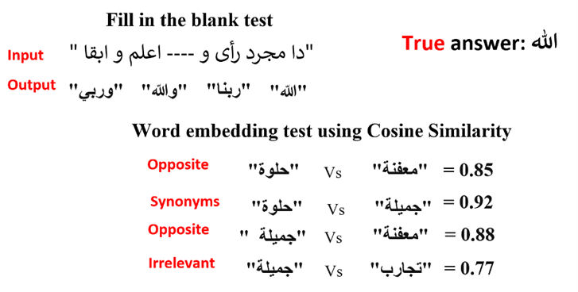
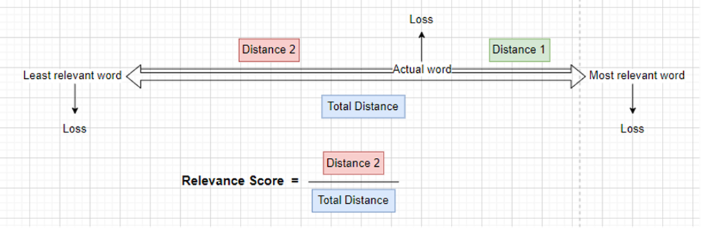
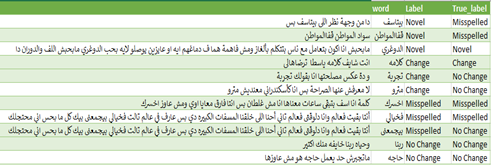

# Automating Novel Terms in Egyptian Arabic

# Table of Contents

[Objective](#1)

[Team Members](#2)

[Project Demo](#3)

[Introduction](#4)

[Background](#5)

[Methodology](#6)

[Dataset](#7)

- [Data Preprocessing](#8)

  - [Data Cleaning](#9)

  - [Data Normalization](#10)

  - [Removing Elongation](#11)

  - [Removing Tashkeel](#12)

  - [Data Correction](#13)

- [Data Visualization](#14)

[Approaches](#15)

- [BERT from Scratch](#16)

- [Clustering Techniques](#17)

- [MARBERT Relevance Score](#18)

[Validation & Verification](#19)

[Overall Results and Analysis](#20)

- [Evaluation](#21)

- [True Labeling](#22)

- [Analysis](#23)

[Deployment](#24)

[Conclusions and Future Works](#25)

[References](#26)

# <a name ="1">Objective</a>

Our graduation project which was part of our AI & Data Science Master's degree at the University of Ottawa sponsored by Microsoft. 

Check all the projects here: [Link](https://github.com/Mostafanofal453)

# <a name="2">Team Members</a>

[Khaled Elsaka](https://www.linkedin.com/in/khaled-el-saka-962700161/)

[Nada Montasser](https://www.linkedin.com/in/nada-montasser-014b1616b/)

[Shaimaa Mamdouh](https://www.linkedin.com/in/shaimaa-mamdouh-2616a9159/)

[Aya Reda](https://www.linkedin.com/in/aya-reda-5202b2191/)

[Mostafa Nofal](https://www.linkedin.com/in/mostafa-nofal-772625194/)

# <a name ="3">Project Demo</a>

https://user-images.githubusercontent.com/96543059/228047818-7fee471e-15d1-4c56-99bf-05d7c5c85a91.mp4

# <a name = "4">Introduction</a>

In recent years, several machine translation techniques have been developed to address the growing issue of automatic translation between texts written in various languages or languages and their dialects. There are some unknown terms that have been created by people due to frequently speaking using dialects or borrowing words from other languages and merging them to the native dialect or terms periodically reused due to global events through time called Novel terms which are new words with a new sense. These terms are unfamiliar terms that could be a barrier that affects accuracy and performance in many applications like summarization, sentiment analysis, and translation because these terms are relatively new and have become more common over time. These terms can be challenging to interpret and translate into understandable language, and they remain unidentified and anonymous. There are many of these terms daily used, especially in a Dialect called Masri in Egypt such as Corona term which has spread and is frequently used among the Egyptians after the epidemic.

# <a name ="5">Background</a>

- [13] Semantic change detection is the task of detecting and analyzing word evolution in textual data over time. For word representation, there are two types of word embedding, static word embedding for semantic meaning representing each word as one vector. However, there are many words that have more than one meaning depending on the context, and that leads us to contextualized word embedding where a separate vector is generated for each word with respect to the context. The most widely used contextual embedding recently is BERT (Bidirectional Encoder Representations from Transformers [14]). Then using clustering to group the word occurrences by the similar vector representation.

- [15] To improve the Egyptian to English translation. First, Bridge the gap between the Egyptian and MSA (Modern Standard Arabic), then translate the MSA to English. The problem with the Egyptian text is the high frequency of the OOV (Out of Vocabulary). OOV could be presented in many forms like Substring Repetition, Compounding Errors, Spelling Differences, and Dialect-Based Errors which we call the true OOV where the word is unknown in that case we can find some synonyms candidates from the context, Then try to find the best candidates for the best Viterbi [16] path. 

- [17] Messages posted on social media networking websites usually include a lot of confusing text. One of the disruptive issues can be the Egyptian dialect. Techniques for optimal processing and analysis of informal texts, such as sentiment analysis and summarization, are required. Also, in order to be more understandable, these confused texts must be translated into their standard form. To translate these texts into Modern Standard Arabic (MSA), different Natural Language Processing (NLP) studies were done. The Egyptian dialect text is converted to Modern Standard Arabic using Word2vec. it tries to identify words that have a semantically similar meanings. Word2vec is based on Continuous Bag-of-Words and Skip-gram (CBOW). 

- [18] The transfer between the Egyptian Arabic dialect and MSA is a one-to-many transformation. As the mapping includes more than one vocabulary, many Egyptian Arabic terms can be transferred in one or more processes via lexicon lookup. To encode the mapping rules from Egyptian Arabic to MSA, the Mapping Table (MT) is developed. Either one-to-one or a one-to-many mapping is used. Three fields make up every entry in this table: the source synonym, the goal colloquial phrase, and the mapping style. One-to-one mapping mode is identified by the number 0 whereas a mapping mode is identified by the value 1. 

- [27] [31] BERT is a Bidirectional Encoder Representation from Transformer meaning that the model takes into consideration not only the previous words of the sentence but also the next ones. It’s trained using self-supervised learning by randomly selecting 15% of the words, 80% of them are replaced by the mask tag and 10% are replaced with the correct words, and the remaining 10% are replaced with wrong words. The model tries to focus on the structure of the sentence and correctly predicts the selected words. After training the model is able to solve fill-in-the-blank tasks and produce contextualized word embeddings carrying the meaning based on the context. BERT uses a WordPiece [39] tokenizer to reduce the number of words in the dictionary, it splits the unknown words into the largest tokens starting from the begging of the word for example “playing” to “play” and “##ing”.

# <a name = "6">Methodology</a>

​																							Figure 1. System Design

# <a name = "7">Dataset</a>

We searched for the datasets in the related work papers and the most well-known websites like:

* Kaggle

* Github

* Huggingface

* Google Datasets

* ScienceDirect

* ResearchGate

* IEEE Xplore

The datasets had different formats like XML, JSON, CSV and text so we unified them all to excel files format.

 

We also worked on labeling the datasets with the year label and filtered them to combine our final output.

 

All the details are here: [2.5+ Million Rows Egyptian Datasets Collection](https://www.kaggle.com/datasets/mostafanofal/two-million-rows-egyptian-datasets)

## <a name="8">Data Preprocessing</a>

Preprocessing Arabic text is an important step in our NLP project. Preprocessing Arabic text on social media, which is typically informal (not standard), is more difficult due to a variety of factors such as the presence of dialect text, common spelling errors, extra characters, diacritical marks, and elongations. As a result, we must perform additional processing to preprocess such Arabic text, such as stripping elongations, diacritical marks, and extra characters. As previously stated, the domain of our project is the Egyptian-Arabic dialect. We did some pre-processing on the Egyptian Dialect from social media and websites. Our method includes three preprocessing modules:

## <a name ="9">Data Cleaning</a>

Most Egyptian text on social media contains noise such as Non-Arabic numbers, Extra characters, Hashtags, Emojis, Links, Users, URLs, any punctuation, and/or mixed language. The first and most important step in preprocessing is cleaning Egyptian text by removing noises.

## <a name ="10">Data Normalization</a>

After cleaning the text, the next step is to convert it to its natural shape using text Normalization.* *We used the regex library and python Arabic corrector within text Normalization.

### <a name ="11">Removing Elongation</a>

Popular Egyptian words on social media like Twitter and Facebook that are found in the data we have collected, are written in informal ways e.g., some words contain repeated characters such as "*مبرووووووك*" instead of "*مبروك*" which indicates congratulations, repeated characters such as "جااااامد*" instead of "*جامد*" and "*ههههههههههههه*" which means laughing and include common spelling mistakes and/or dialects.* Our proposed normalization algorithm replaces a non-normal word with a normal one by removing the repeated characters.

### <a name ="12">Removing Tashkeel</a>

In the Arabic language, there is a sort of art called Tashkeel to pronounce words in a proper way such as fathha, shadda, dama. We worked to remove any tashkeel that can be an obstacle in the Modeling phase and OOV detection.

### <a name ="13">Data Correction</a>

- To go more through the data normalization, we worked on Text Correction as in social media there is a great possibility that people write incorrect words to overcome this possibility, we correct the text by checking the spelling of Arabic sentences. We used the built-in library to correct the data called ar_corrector, which is a simple library for checking Arabic sentence spelling. This library uses a vocabulary of +500K words and corrects misspelled words using 1-edit distance and 2-edit distance. It also employs a 1-n-gram language model to correct words based on the context of the text.

- Aِfter applying correction using ar_corrector,we found that this method did not fit into the complexity of the Egyptian dialect and the outcomes were not satisfying so we applied many methods to fit the best corrections to the text. Here is the data correction workflow:

​																						Figure 2. Word Correction Mix Workflow

- Beginning with a corpus of words from MARBert training data as a dictionary to correct the text from it, we used the Jaccard similarity method, which measures the similarity between two sets of data, the first being the outcome from each method we applied and the second being the dictionary, and we took the highest cosine similarity for word embedding for each word.

- Our approach goes with creating many methods from scratch by making random changes to each word, such as adding or removing, or switching characters, and then generating a list of possible words that can be matched to the dictionary and testing these methods on 5000 words from Gutenberg text data.

- By testing these methods on a sample of Egyptian data, we discovered that the mix Jaccard method, which is Cosine similarity for word embeddings with positional encoding, was the best method for our data.

																					

​																		Figure 3. Misspelled Correction Methods Comparison  

The algorithm of Word embedding with positional encoding goes through these steps:

1. Initialize vector of zeros of length = 29, each index for an Arabic character.

2. Create a 200\*300 positional matrix using positional encoding in transformer models. 200 is the maximum word length for (200 characters) and 300 is the output dimension for each character.

3. Get the average of the 300 dimensions for each of the 200 positions.

4. Add the positional encoding average that corresponds to the index of the character in the word to the word vector.

## <a name ="14">Data Visualization</a>

We explore and analyze the text data by visualization using the Arabic world cloud to show the most frequent words in the data.

​																									Figure 4. Word Cloud

# <a name ="15">Approaches</a>

Masked Language Model (BERT) Selection:

​													Figure 5. Training pathways to maximize BERT model performance 

Selecting the best BERT model is critical because the project's solutions depend on that model's outcome. Not only there are many pre-trained models, but also there are different paths that we can take. In figure 5, which path is better? Using a pre-trained model then fine-tuning (1a, 1b, 1d) or using the pre-trained then retraining on the domain-specific corpus (1a, 1b, 1c, 1d) or training the model from scratch of the domain-specific corpus (2a, 2b, 2d). The experiment results [30] state that it's better to train the model from scratch when working on domain-specific data, but if there is a pre-trained model which is trained on some data from that domain it's much better to retrain that model on more domain datasets. Although this project is not meant for any domain-specific corpus such as biomedical space, the same idea and characteristics exist. The Egyptian dialect has many different terms, phrases, and sentence structures than the modern standard Arabic (MSA).

## <a name ="16">BERT from Scratch</a>

The first approach is to divide our dataset into time periods and train the BERT model from scratch on the collected dataset for some reasons. First it will be easier to train on a dataset from period t1 and test from time t2 which will contain many novel terms and new usages for words and will be easier for testing. The second reason is that it will only be trained in the Egyptian dialect.

 

Trained Roberta from scratch [31] on a sample of the dataset from period t1 for only 2 epochs to see quick results and improve later. The results weren't good in figure 6 for both fills in the blank and the word embedding test. The model was unable to predict the correct word for fill in the blank test and outputs only stop-words and outputs almost the same for other sentences. The cosine similarity test for the opposite words is higher than synonyms which is not correct.

​																					Figure 6. Test Roberta after training from scratch 

**Limitation**

The model needed a lot of time to complete the training process. 

## <a name ="17">Clustering Techniques</a>

The second approach is to use word embeddings and then clustering the context change. If a word appeared in new context, it will be used with different words that differ from the first context so it will be in another cluster.

 

After using the tokenizer of MARBERT and getting the word embeddings of each sentence and its words, We deleted the unique words in the dataset to decrease duplication and save time. The word embedding for each word differs from one sentence to another depending on the context of the sentence.

  

We used DBSCAN, affinity propagation, and k-means with a range of k values for clustering. First experiment with K-means we build a function to return the cosine similarity to be used as a metric parameter for K-means instead of Euclidean metric. A cosine similarity metric is a way to improve the result by measuring the similarity between the words. The silhouette score is good by trying different K but not the best result. The problem of K-means needs the number of clusters, but this is hard as the number of words in the corpus is very large and can’t detect these different meanings manually. 

 

In a second experiment with DBSCAN, It can categorize the word embeddings of the words and discriminate between noisy data. Epsilon (Eps1) and the minimal number of points/data (MinPoints), two parameters, are based on a user-defined neighbor radius and the number of points already present in the radius. But the issue of DBSCAN in this problem may be that some words are important and are categorized as noise data. In the past

 

Affinity propagation has been utilized in a variety of linguistic tasks, including word sense induction. The incremental graph-based method that underlies affinity propagation is somewhat reminiscent of PageRank. Its primary advantage is that the number of clusters is not predetermined but rather inferred during training. Using common hyperparameters, we implemented Scikit-learn in this task. Finally, Affinity Propagation is the appropriate algorithm to apply with a silhouette score of 0.3 as shown in the table because it doesn’t need several clusters on the contrary, it gives us the number of clusters for each word meaning, and if this meaning is changed or not, it would be in a different cluster as shown in figure (4).

| **Method**           | **silhouette score** |
| -------------------- | -------------------- |
| K Means              | **0.06**             |
| DBSCAN               | **0.02**             |
| Affinity Propagation | **0.3**              |

​															Figure 7. The cluster of each Word depends on its word embedding 

As shown in figure (6) the word “صفرا” has four different meanings so we have different embeddings so each word means to be in a different cluster (4 clusters).

​																		Figure 8. Examples of words with different meanings 

**Limitation**

We can't define an accurate number of clusters because there are too many contexts to limit in the dataset.

## <a name ="18">MARBERT Relevance Score</a>

We found that MARBERT [32] is better than BERT because it is focused on both Dialectal Arabic (DA) and MSA and trained on 1B Arabic tweets from different dialects including the Egyptian, The dataset makes up 128GB of text (15.6B tokens) and 100k word piece. The model outperformed 21 models (75%) and was outperformed by seven models (25%) [33], and achieves the SOTA on 30 out of 43 datasets on 5 tasks (sentiment analysis, social meaning, topic classification, dialect identification, and named entity recognition) [38] and performs best when dealing with dialectal data.

 

After trying MARBERT, the results make more sense in figure 9. The predicted answers for the fill in the blank sentence are correct and they are synonyms. The semantic similarity using the cosine similarity metric is high for synonyms and lower for opposite words and much lower for irrelevant words. The word and its opposite could be used in the same context and that’s why the opposite words have higher cosine similarity than the irrelevant ones.

​												Figure 9. Test MARBERT for filling in the blanks and the word embedding test 

**Relevance score solution:**

The solution is based on the context of the sentences. Measuring how relevant the target word is to the sentence is the key.

​																				Figure 10. OOV detection challenge solution 

Facing the challenge of differentiating between misspelled and novel terms while detecting the out-of-vocabulary (OOV). Figure 10 shows the solution for detecting the novel terms and also the misspelled ones. Given the sentence and target word and after correcting the word if it is in the 100 words predicted by the MARBERT model after masking the target word in the sentence if yes then we use a reward point for measuring the relevance percentage. If the percentage is higher than 50%, then the original word is labeled as misspelled and if not then it's novel.

​																		Figure 11. Computing Relevance and Irrelevance Percentages 

Measuring the model's loss at the word (Actual loss), the most relevant word (Relevant loss), and a random word not in the top 100 predicted (Irrelevant loss). Distance 1 is the absolute difference between the actual loss and the relevant loss. Distance 2 is the absolute difference between the Actual loss and the irrelevant loss. The total distance equals distance 1 plus distance 2. The relevance percentage equals distance 2 and adds to it the reward point (set to 50% of the actual loss) if the corrected word is in the top predicted 100 then divided by the total distance as illustrated in Figure 11.

 

The solution in figure 10 could also be used for detecting the new usages of words with some tiny changes like removing the misspelled correction step and replacing the OOV and misspelled label with new usage and normal respectively.

​																						Figure 12. OOV and Misspelled Test

The solution is tested on a sample of sentences like in figure 12 the solution correctly detects the misspelled and novel words. The word* المشتروع *after correction becomes* المشروع *the percentage of relevance is 92.89 which is higher than 50% and so is labeled as misspelled. On the right, the word* نرم *after correction* نجم and the percentage of relevance is 27.86 which is lower than 50% and so is labeled as a novel word.

 

The solution has many hyper-parameters like the number of top predicted words, the value of the reward and penalty points, and the threshold value to say that the word is novel or misspelled.

​																					Figure 13. Relevance Score Solution

A more robust general solution was developed with fewer hyper-parameters illustrated in figure 13. Starting with a sentence and the target word. If it's not in the dictionary (The MARBERT model's trained data) then it's corrected by the closest word from the dictionary. Also, after that the relevance score is evaluated and if it's less than input threshold then it's a novel word and misspelled other than that. On the other hand, if the word is in the dictionary then it's either a normal or a new-meaning word and the decision is back to the relevance score. 

​																				Figure 14. Measuring the Relevance Score 

Instead of using the top 100 predictions, and using a random irrelevant word other than them, the model predicts a 100k word piece for each mask and so takes the highest and lowest prediction from them as the most relevant and least relevant respectively, and measures the loss at them. The relevance score then is the absolute difference between the actual loss and the least relevant loss divided by the total distance as illustrated in figure 14.

 

That solution has only two hyper-parameters which are the threshold of the novel terms and the threshold for new meaning and they are taken as input from the user and the default value is 0.5. Note that the reward and the penalty point could be applied here too. 

# <a name="19">Validation & Verification</a>

Regarding the model evaluation, we will select some words to represent the new words (OOV) from the dataset and search for their sentences. Those sentences that contain our selected OOV are our test data. We collected 11 datasets of the MARBERT model train data from its GitHub repository. There were two reasons for that. One was to build the corpus for the correction part by splitting all of the sentences into separate words to compare with the misspelled data. The second reason was to search for context change sentences.

| **Reference**                                                | **Data**  | **TRAIN** | **DEV** | **TEST** |
| ------------------------------------------------------------ | --------- | --------- | ------- | -------- |
| [Abdul-](https://www.aclweb.org/anthology/2020.osact-1.3)[Mageed](https://www.aclweb.org/anthology/2020.osact-1.3)[ et al. (2020b)](https://www.aclweb.org/anthology/2020.osact-1.3) | AraNET    | 100K      | 14.3K   | 11.8K    |
| [Al-](https://www.aclweb.org/anthology/P16-1066)[Twairesh](https://www.aclweb.org/anthology/P16-1066)[ et al. (2017)](https://www.aclweb.org/anthology/P16-1066) | AraSenTi  | 11,117    | 1,407   | 1,382    |
| [Abu Farha and Magdy   (2017)](https://www.aclweb.org/anthology/2020.osact-1.5) | ArSarcasm | 8.4K      | -       | 2.K      |
| [Elmadany](https://www.semanticscholar.org/paper/ArSAS-%3A-An-Arabic-Speech-Act-and-Sentiment-Corpus-Elmadany-Mubarak/d32d3bb226f1738f72c415c6b03b5ad66ff604a4)[   et al. (2018)](https://www.semanticscholar.org/paper/ArSAS-%3A-An-Arabic-Speech-Act-and-Sentiment-Corpus-Elmadany-Mubarak/d32d3bb226f1738f72c415c6b03b5ad66ff604a4) | ArSAS     | 24.7K     | -       | 3.6K     |
| [Nabil et al. (2015)](https://www.aclweb.org/anthology/D15-1299) | ASTD      | 24.7K     | -       | 664      |
| [Nabil et al. (2015)](https://www.aclweb.org/anthology/D15-1299) | ASTD-B    | 1.06K     | -       | 267      |
| [Rosenthal et al. (2017)](https://www.aclweb.org/anthology/S17-2088.pdf) | SemEval   | 24.7K     | -       | 6.10K    |
| [Salameh et al. (2015)](https://www.aclweb.org/anthology/N15-1078) | SYTS      | 960       | 202     | 199      |
| [Zaidan](https://www.mitpressjournals.org/doi/full/10.1162/COLI_a_00169)[ and ](https://www.mitpressjournals.org/doi/full/10.1162/COLI_a_00169)[Callison](https://www.mitpressjournals.org/doi/full/10.1162/COLI_a_00169)[-Burch   (2014)](https://www.mitpressjournals.org/doi/full/10.1162/COLI_a_00169) | AOC (2)   | 86.5K     | 10.8K   | 10.8K    |
| [Zaidan](https://www.mitpressjournals.org/doi/full/10.1162/COLI_a_00169)[ and ](https://www.mitpressjournals.org/doi/full/10.1162/COLI_a_00169)[Callison](https://www.mitpressjournals.org/doi/full/10.1162/COLI_a_00169)[-Burch   (2014)](https://www.mitpressjournals.org/doi/full/10.1162/COLI_a_00169) | AOC (3)   | 35.7K     | 4.46K   | 4.45K    |
| [Zaidan](https://www.mitpressjournals.org/doi/full/10.1162/COLI_a_00169)[ and ](https://www.mitpressjournals.org/doi/full/10.1162/COLI_a_00169)[Callison](https://www.mitpressjournals.org/doi/full/10.1162/COLI_a_00169)[-Burch   (2014)](https://www.mitpressjournals.org/doi/full/10.1162/COLI_a_00169) | AOC (4)   | 86.5K     | 10.8K   | 10.8K    |

​																					Figure 15. Train Data Words Corpus

# <a name="20">Overall Results and Analysis</a>

## <a name ="21">Evaluation</a>

Regarding the evaluation dataset. The model trained on data until 2020. We chose to search in Goodreads website for Egyptian dialect books. We found 9 books and picked one published in 1994 which is older than the model. The second dataset from Facebook consists of Egyptian Dialect Corpus. It was released in 2021 which is newer than the training data from the model.

​																							Figure 16. Taghreed Dataset

​																						Figure 17. Goodreads Book Sample

## <a name ="22">True Labeling</a>

We selected the list of words for the evaluation based on the four conditions mentioned before and changed the threshold to filter the most accurate words for us.

​																						Figure 18. Filter Words Example 

Finally for the labeling, we searched for the sentences which include the context change words and used twitter API advanced search to make sure that there were two different contexts for the same word.

​																				Figure 19. Searching for word context change 

Then we selected 20 sentences for each label putting their true labels manually to compare with our model and the accuracy was around 61%.

## <a name ="23">Analysis</a>

When it comes to the comparison between the models. The model made from scratch definitely needed a lot of time to train so we moved to try the other approaches. What was good about the solution based on the relevance score is its general purpose. It can detect all kinds of novel terms whether they are completely new, misspelled, or words that have changed their meaning. Also, we didn’t need to train the model on all the corpus compared to the clustering model. Finally, we can use a threshold to filter the number of words that came from it to take the most accurate ones. Regarding the outcomes, the project helped us to know how to deal with BERT which is one of the most well-known models in NLP as well as various ways to correct misspelled words and finally how to deploy our solution to a website by using flask.

# <a name ="24">Deployment</a>

Our deployment plan was integrating our model with a website to make our model easily used by the end user. For designing the front end of the website, we have used HTML, CSS and java script using Dreamweaver.

 

The website simply consists of landing page:

 

About us page for more information about our project, then the deployment and integration page.

In this part the user enters the text he wants to analyze.

This is a sample of the results our model does, as it offers a general report for each word in the sentence. 

Then other 3 tables will be generated to distinguish if the words are novel terms, misspelled, or meaning doesn’t change, as shown in the following figures.

The backend part was integrating our frontend website with our model, to do this we used Flask.

# <a name ="25">Conclusions and Future Works</a>

Detecting the novel terms while differentiating between them and the misspelled ones and also detecting the words with a new usage. The available solutions focus on analyzing the meaning change of the words by selecting a sample of words and clustering their embeddings to find the words with new meanings. While we’ve tried this solution too, it’s not practical to cluster all the words in the corpus. This project handles a new problem and provides and new general practical solution which is the relevance score for not only the meaning change detection but also the novel and misspelled words. No need for clustering all the corpora, the inputs are the text, and the filtering threshold then the novel, misspelled new meaning, and normal words are filtered. Testing the solution is also a challenge as the MARBERT model was trained on some data which is from 2020 and the collected test data is from 2021 (Taghreed). The time gap between them is small and the new words in the test data are rare. moreover, the selected test words require human labeling and can sometimes be incorrect. In general, the solution is logically robust but depends on some factors which require improvements like retraining the MARBERT model on more Egyptian text, improving the correction, and Hyperparameter-tuning for the novel terms and new meaning threshold to use the optimal value.

# <a name ="26">References</a>

*[1] Omar F. Zaidan and Chris Callison-Burch. 2011. The Arabic Online Commentary Dataset: an Annotated Dataset of Informal Arabic with High Dialectal Content. In Proceedings of the 49th Annual Meeting of the Association for Computational Linguistics: Human Language Technologies, pages 37–41, Portland, Oregon, USA. Association for Computational Linguistics.* 

*[2] Kora, R., & Mohammed, A. (2019). Corpus on Arabic Egyptian tweets [Data set]. Harvard Dataverse. https://doi.org/10.7910/DVN/LBXV9O*

*[3] Tarmom, T., Teahan, W., Atwell, E. and Alsalka, M.A., 2020. Compression versus traditional machine learning classifiers to detect code-switching in varieties and dialects: Arabic as a case study. Natural Language Engineering, 26(6), pp.663-676.*

*‌[4] nadaaym, “Topic-extraction-data,” GitHub, Jan. 20, 2019. https://github.com/nadaaym/Topic-extraction-data (accessed Jan. 15, 2023).*

*[5]“Index of /habibi,” ucrel-web.lancaster.ac.uk. http://ucrel-web.lancaster.ac.uk/habibi/ (accessed Jan. 15, 2023).*

*‌[6]G. Kumar, “noisychannel/ARZ_callhome_corpus,” GitHub, Aug. 09, 2022. https://github.com/noisychannel/ARZ_callhome_corpus (accessed Jan. 15, 2023).*

*‌[7]“ArabicReddit,” www.kaggle.com. https://www.kaggle.com/datasets/abadrawy/arabicreddit (accessed Jan. 15, 2023).*

*[8] 2.5+ million rows Egyptian datasets collection. Kaggle. (n.d.). Retrieved January 15, 2023, from https://www.kaggle.com/datasets/mostafanofal/two-million-rows-egyptian-datasets*

*[8] “Arabic - Egyptian comparable Wikipedia corpus,” www.kaggle.com. https://www.kaggle.com/datasets/mksaad/arb-egy-cmp-corpus (accessed Jan. 15, 2023).*

*[9] “Dialectal Arabic Datasets,” GitHub, Jan. 12, 2023. https://github.com/qcri/dialectal_arabic_resources (accessed Jan. 15, 2023).*

*[10] we7el, “The SADID Evaluation Datasets for Low-Resource Spoken Language Machine Translation of Arabic Dialects,” GitHub, Jun. 23, 2022. https://github.com/we7el/SADID (accessed Jan. 15, 2023).* 

*[11] “DART.zip,” Dropbox. https://www.dropbox.com/s/jslg6fzxeu47flu/DART.zip?dl=0 (accessed Jan. 15, 2023).*

*[12] Martinc, M., Montariol, S., Zosa, E., & Pivovarova, L. (2020, April). Capturing evolution in word usage: just add more clusters? In Companion Proceedings of the Web Conference 2020 (pp. 343-349).*

*[13] Martinc, Matej, et al. "Capturing evolution in word usage: just add more clusters?." Companion Proceedings of the Web Conference 2020. 2020.* 

*[14] Jacob Devlin, Ming-Wei Chang, Kenton Lee, and Kristina Toutanova. 2019. BERT: Pre-training of deep bidirectional transformers for language understanding. In Proceedings of the 2019 Conference of the North American Chapter of the Association for Computational Linguistics: Human Language Technologies, Volume 1 (Long and Short Papers). 4171–4186.* 

*[15] Durrani, N., Al-Onaizan, Y., Ittycheriah, A. (2014). Improving Egyptian-to-English SMT by Mapping Egyptian into MSA. In: Gelbukh, A. (eds) Computational Linguistics and Intelligent Text Processing. CICLing 2014. Lecture Notes in Computer Science, vol 8404. Springer, Berlin, Heidelberg. https://doi-rg.proxy.bib.uottawa.ca/10.1007/978-3-642-54903-8_23*

*[16] En.wikipedia.org. 2022. Viterbi algorithm - Wikipedia. [online] Available at: <https://en.wikipedia.org/wiki/Viterbi_algorithm#:~:text=The%20Viterbi%20algorithm%20is%20a,hidden%20Markov%20models%20(HMM).> [Accessed 13 August 2022].* 

 *[17] H Almansor, E., & Al-Ani, A. (2017). Translating dialectal Arabic as low resource language using word* *embedding. RANLP 2017 - Recent Advances in Natural Language Processing Meet Deep Learning.* 

*[18] Shaalan, K., H. Bakr, and I. Ziedan, "Transferring Egyptian Colloquial Dialect into Modern Standard Arabic", International Conference on Recent Advances in Natural Language Processing (RANLP 2007), Borovets, Bulgaria, John Benjamins, pp. 525–529, sep, 2007* 

 *[19] Huggingface.co. 2022. CAMeL-Lab/bert-base-arabic-camelbert-mix · Hugging Face. [online] Available at: <https://huggingface.co/CAMeL-Lab/bert-base-arabic-camelbert-mix> [Accessed 14 August 2022].* 

 *[20] Chris McCormick and Nick Ryan. (2019, May 14). BERT Word Embeddings Tutorial. Retrieved from http://www.mccormickml.com* 

*[21] Huggingface.co. 2022. What is Fill-Mask? - Hugging Face. [online] Available at: <https://huggingface.co/tasks/fill-mask> [Accessed 14 August 2022].* 

*[22] Omar F. Zaidan and Chris Callison-Burch. 2011. The Arabic Online Commentary Dataset: an Annotated Dataset of Informal Arabic with High Dialectal Content. In Proceedings of the 49th Annual Meeting of the Association for Computational Linguistics: Human Language Technologies, pages 37–41, Portland, Oregon, USA. Association for Computational Linguistics.*

 *[23] Tarmom, T., Teahan, W., Atwell, E. and Alsalka, M.A., 2020. Compression versus traditional machine learning classifiers to detect code-switching in varieties and dialects: Arabic as a case study. Natural Language Engineering, 26(6), pp.663-676.* 

 *[24] R. Kora and A. Mohammed, “Corpus on Arabic Egyptian tweets.” Harvard Dataverse, 2019.*

 *[25] Team, K., 2022. Keras documentation: End-to-end Masked Language Modeling with BERT. [online] Keras.io. Available at: <https://keras.io/examples/nlp/masked_language_modeling/> [Accessed 27 August 2022].* 

 *[26] Horan, C., 2022. Unmasking BERT: The Key to Transformer Model Performance -neptune.ai. [online] neptune.ai. Available at: <https://neptune.ai/blog/unmasking-bert- transformer-model-performance> [Accessed 28 August 2022].* 

*[27] Pogiatzis, A. (2019, March 20). NLP: Contextualized word embeddings from bert. Medium. Retrieved September 13, 2022, from https://towardsdatascience.com/nlp-extract-contextualized-word-embeddings- from-bert-keras-tf-67ef29f60a7b* 

*[28] Tahmasebia, Nina, Lars Borina, and Adam Jatowtb. "Survey of computational approaches to lexical semantic change detection." Computational approaches to semantic change 6 (2021): 1.*

*[29] Rodina, Julia, and Andrey Kutuzov. "RuSemShift: a dataset of historical lexical semantic change in Russian." arXiv preprint arXiv:2010.06436 (2020).* 

*[30] A. Rajasekharan, “Maximizing BERT model performance,” Medium, Jan. 20, 2021. https://towardsdatascience.com/maximizing-bert-model-performance-539c762132ab (accessed Jan. 15, 2023).*

*[31] J. Briggs, “How to Train a BERT Model From Scratch,” Medium, Sep. 02, 2021. https://towardsdatascience.com/how-to-train-a-bert-model-from-scratch-72cfce554fc6*

*[32] Muhammad Abdul-Mageed, AbdelRahim Elmadany, and El Moatez Billah Nagoudi. 2021.* [*ARBERT & MARBERT: Deep Bidirectional Transformers for Arabic*](https://aclanthology.org/2021.acl-long.551)*. In Proceedings of the 59th Annual Meeting of the Association for Computational Linguistics and the 11th International Joint Conference on Natural Language Processing (Volume 1: Long Papers), pages 7088–7105, Online. Association for Computational Linguistics.*

*[33] Alammary, A.S. (2022) “Bert models for Arabic Text Classification: A systematic review,” Applied Sciences, 12(11), p. 5720. Available at: https://doi.org/10.3390/app12115720.* 

*[34]  “re — Regular expression operations,” Python documentation. [Online]. Available: https://docs.python.org/3/library/re.html. [Accessed: 15-Jan-2023].*

*[35]  “Ar-corrector,” PyPI. [Online]. Available: https://pypi.org/project/ar-corrector/. [Accessed: 15-Jan-2023].*

*[36]  Machinelearningmastery.com. [Online]. Available: https://machinelearningmastery.com/a-gentle-introduction-to-positional-encoding-in-transformer-models-part-1/. [Accessed: 15-Jan-2023].*

*[37]  “Create wordcloud with Arabic — wordcloud 1.8.1 documentation,” Github.io. [Online]. Available: https://amueller.github.io/word_cloud/auto_examples/arabic.html. [Accessed: 15-Jan-2023].*

[38] *Marbert: UBC ARBERT and MARBERT Deep  Bidirectional Transformers for Arabic. .*  

*[39] Y. Wu, M. Schuster, Z. Chen, Q. Le, M. Norouzi, W. Macherey, M. Krikun, Y. Cao, Q. Gao, K. Macherey, J. Klingner, A. Shah, M. Johnson, X. Liu, Ł. Kaiser, S. Gouws, Y. Kato, T. Kudo, [40] H. Kazawa, K. Stevens, G. Kurian, N. Patil, W. Wang, C. Young, J. Smith, J. Riesa, A. Rudnick, O. Vinyals, G. Corrado, M. Hughes and J. Dean* [*Google’s Neural Machine Translation System: Bridging the Gap between Human and Machine Translation*](https://arxiv.org/pdf/1609.08144.pdf) *(2016)*
